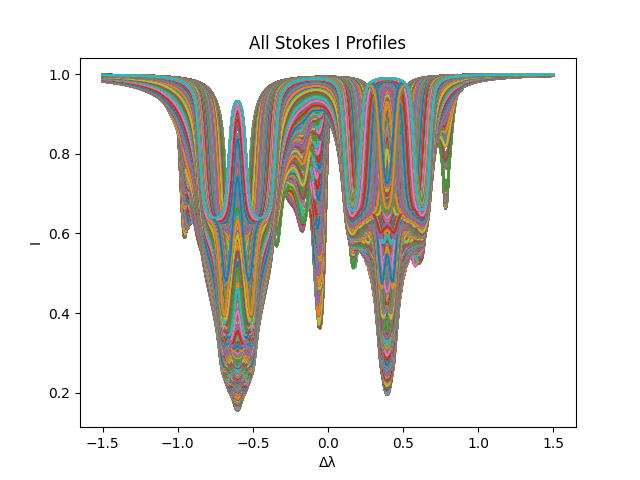
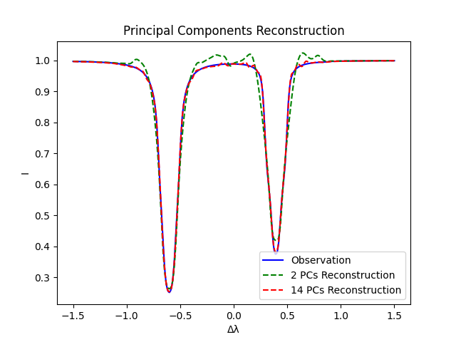

# Deep Learning for Stokes Profile Synthesis
**Author**: Leonardo Barberi

## Description
This repository hosts the implementation of the algorithms to achieve an automatization of Stokes Profile Synthesis using deep learning.
It includes processing scripts for pre-processing the data, training the models, and evaluating the results.

## Learning Problem
The learning problem is formulated as a regression task, where the input is a set of physical parameters that uniquely determine Stokes profiles, and the output is 
the corresponding Stokes profile. Due to the high-dimensional nature of Stokes profiles, we employ a deep learning model
to learn the mapping between the input parameters and a compact representation of the output profiles, using functional principal component analysis.

## Functional Principal Component Analysis
Analogously to multivariate principal component analysis (PCA), functional PCA is an analysis technique that recovers the 
principal components, i.e. the functions that best capture the variability of a set of functions.

### Visualizations
The figures below illustrate various aspects of the structures analyzed in the study.

#### Stokes Profiles

<figcaption> All Stokes I Profile functions present in the dataset. Each color represents one function. </figcaption>

#### Functional Principal Component Analysis

<figcaption> The first two functional principal components pertaining to the Stokes I profiles in our dataset </figcaption> 

#### Functional Principal Component Analysis

<figcaption> Reconstruction of a sample Stokes I profile function using 2 vs 14 principal components </figcaption> 


## Installation
To reproduce the analysis environment, you will need Python 3.6 or later. Please install the required Python packages listed in `requirements.txt`.

```bash
git clone git@github.com:lbarberi1927/solar_spectropolarimetry.git
cd solar_spectropolarimetry
pip install -r requirements.txt
```

## Data
The data employed in our analysis is sourced from simulations ran by IRSOL - Istituto Ricerche Solari Locarno.
To train the model, create the files and directories as specified in the `configs/data` file. This is very important to 
specify both the directories from which to read the data and to save the preprocessed data for training.

To prepare the data for training, run the following scripts.

From the home directory of the SIRIUS cluster (or whichever cluster the raw data is stored in):

```bash
python3 -m src.preprocess.single_file_transfer
```

If you wish to run the training locally, you must then download the preprocessed data to your local machine. The name of 
the file is specified in the `configs/data.py` file.
Next, run the following scripts to finish preprocessing the data:

```bash
python3 -m src.preprocess.functional_PCA_input_output
python3 -m src.preprocess.split_normalize
```

Your data folder will now be populated with a directory for each stokes profile, and each directory will contain the
input and output data for the deep learning model, already split for training and testing.

## Training
To train the deep learning model, a sbatch script is provided to run the training on a high-performance computing cluster.
Run the following commands from the source directory to train the model:

```bash
sbatch runner.sh
```

Training configurations can be modified in the `configs/NN_config.py` file. The computing resources needed for training 
are specified in the `runner.sh` script.

If you wish to run training locally, simply run the following command:

```bash
python3 -m src.core.train
```

The trained model will be saved in the `logs` directory, under the name specified in the `configs/NN_config.py` file.

## Deployment
To calculate the four components (I, Q, U, V) of the Stokes vector, given a set of input physical parameters, run the 
following commands and follow the instructions on the API interface:

```bash
cd deployment
python3 api.py
```