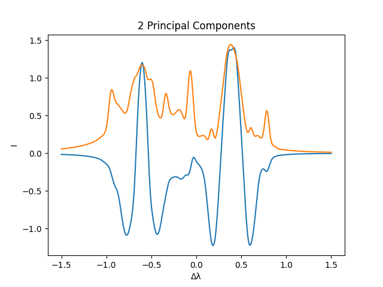

# Deep Learning for Stokes Profile Synthesis
**Author**: Leonardo Barberi

## Description
This repository hosts the implementation of the algorithms to achieve an automatization of Stokes Profile Synthesis using deep learning.
It includes processing scripts for pre-processing the data, training the models, and evaluating the results.

## Learning Problem
The learning problem is formulated as a regression task, where the input is a set of physical parameters that uniquely determine Stokes profiles, and the output is 
the corresponding Stokes profile. Due to the high-dimensional nature of Stokes profiles, we employ a deep learning model
to learn the mapping between the input parameters and a compact representation of the output profiles, using functional principal component analysis.

## Functional Principal Component Analysis
Analogously to multivariate principal component analysis (PCA), functional PCA is an analysis technique that recovers the 
principal components, i.e. the functions that best capture the variability of a set of functions.

### Visualizations
The figures below illustrate various aspects of the structures analyzed in the study.

#### Stokes Profiles

*All Stokes I Profile functions present in the dataset. Each color represents one function.*

#### Functional Principal Component Analysis

*The first two functional principal components pertaining to the Stokes I profiles in our dataset*

#### Functional Principal Component Analysis

*Reconstruction of a sample Stokes I profile function using 2 vs 14 principal components*


## Installation
To reproduce the analysis environment, you will need Python 3.6 or later. Please install the required Python packages listed in `requirements.txt`.

```bash
git clone git@github.com:lbarberi1927/solar_spectropolarimetry.git
cd solar_spectropolarimetry
pip install -r requirements.txt
```

## Deployment
To calculate the four components (I, Q, U, V) of the Stokes vector, given a set of input physical parameters, run the 
following commands and follow the instructions on the API interface:

```bash
cd deployment
python3 api.py
```

## Data
The data employed in our analysis is sourced from simulations ran by IRSOL - Istituto Ricerche Solari Locarno. The data is not publicly available.
